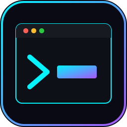
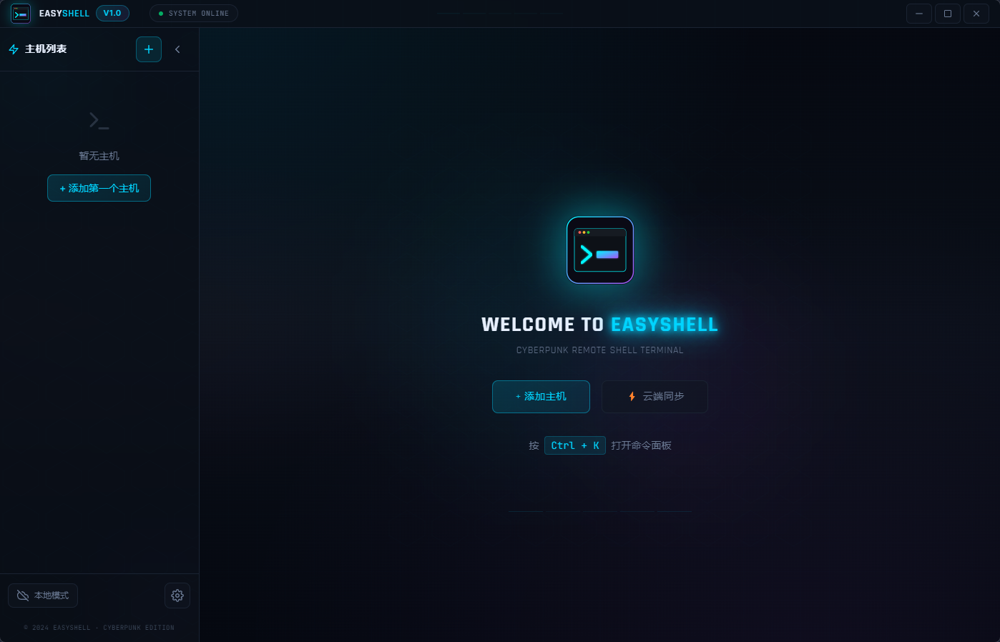
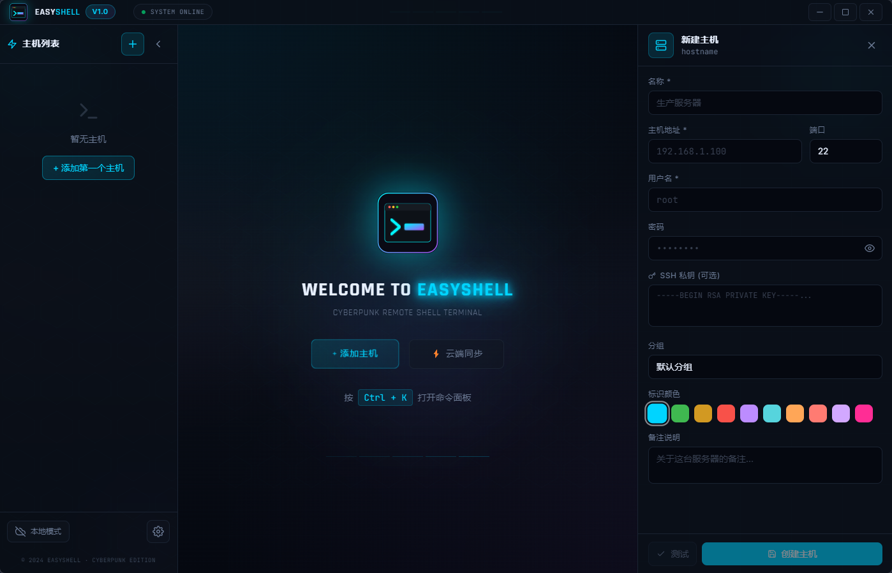
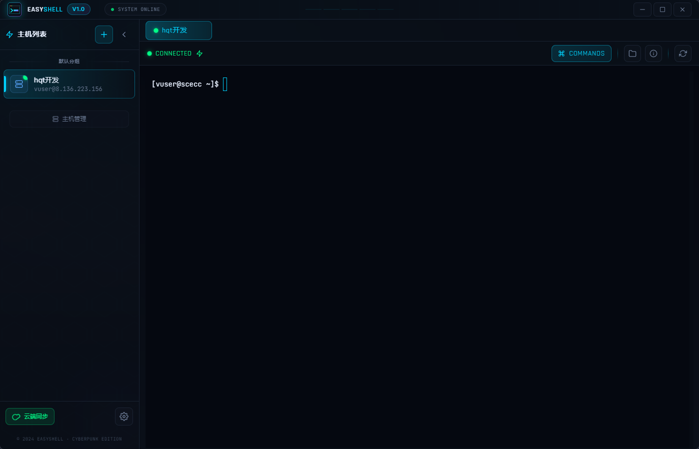
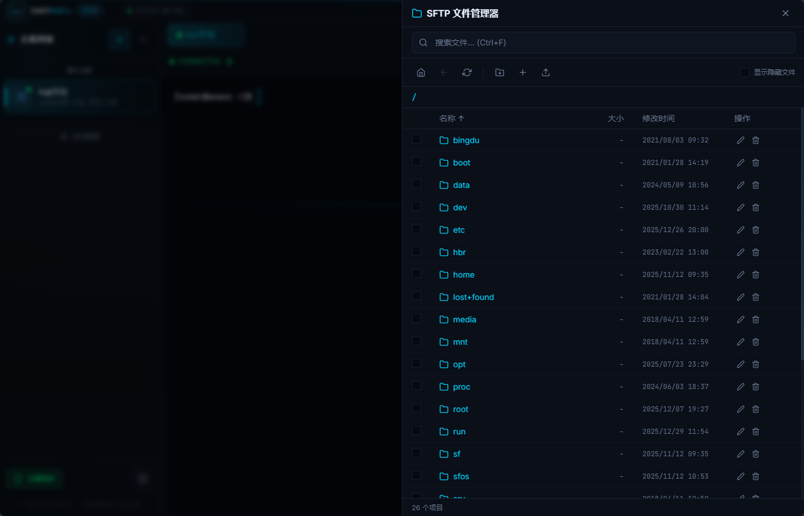
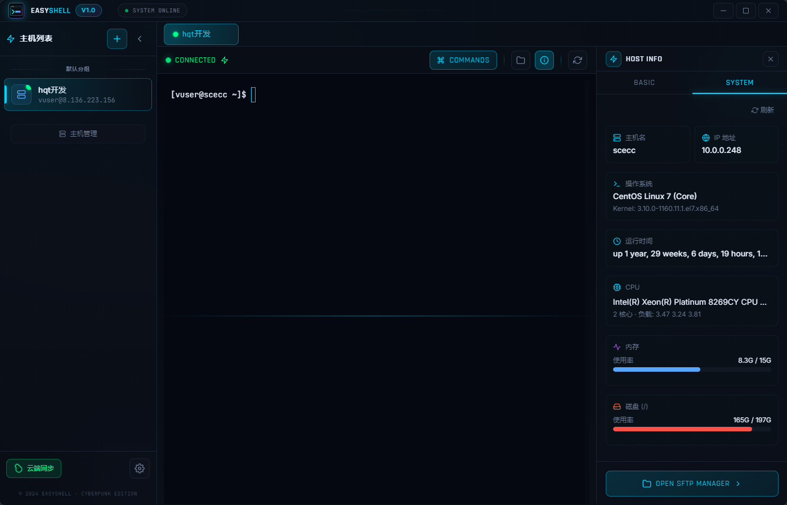
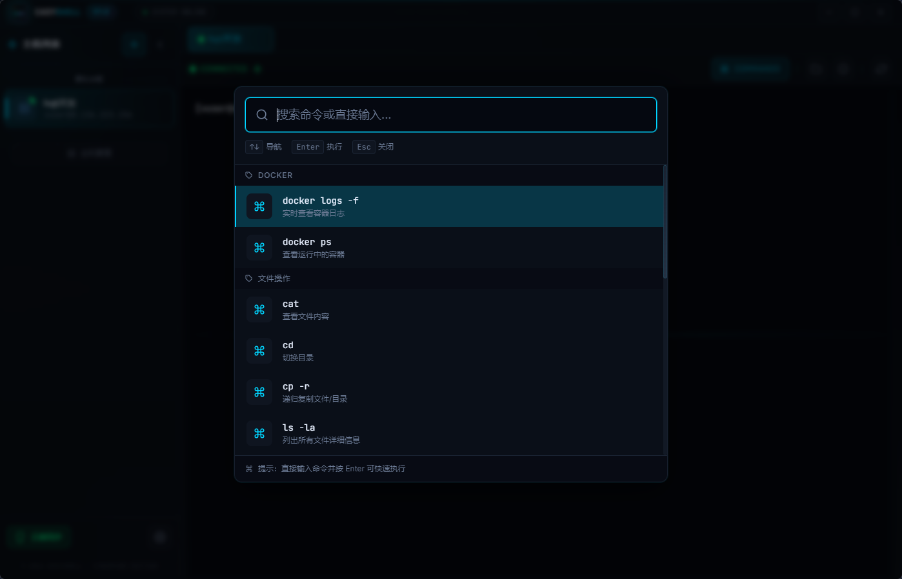
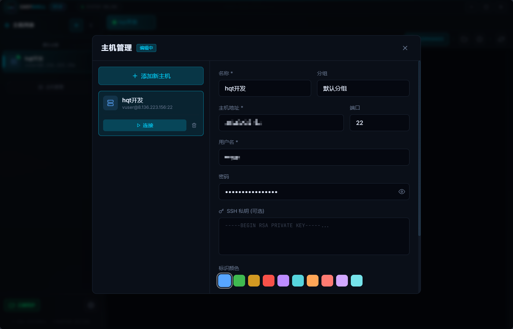
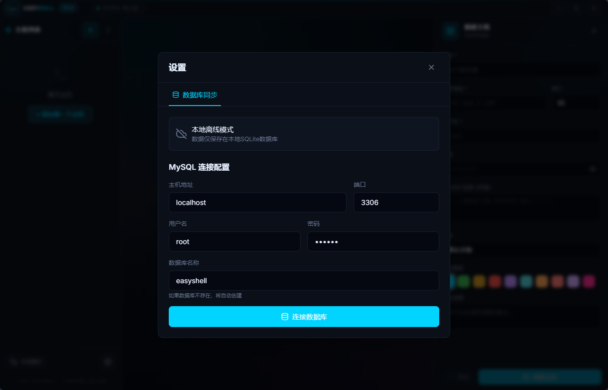

<p align="center">
  
</p>

<h1 align="center">EasyShell</h1>

<p align="center">
  <strong>🚀 赛博朋克风格的跨平台远程 Shell 管理终端</strong>
</p>

<p align="center">
  <a href="https://github.com/ethanfly/easyshell"></a>
  <a href="https://github.com/ethanfly/easyshell/releases"></a>
  
  
  
</p>

<p align="center">
  支持 <strong>Windows</strong> · <strong>macOS</strong> · <strong>Linux</strong> · <strong>Android</strong> 多平台运行
</p>

<p align="center">
  <a href="https://github.com/ethanfly/easyshell">GitHub</a> ·
  <a href="https://github.com/ethanfly/easyshell/releases">下载</a> ·
  <a href="https://github.com/ethanfly/easyshell/issues">反馈问题</a>
</p>

---

## 📸 界面预览

### 🏠 欢迎界面

精心设计的赛博朋克风格欢迎界面，霓虹光效与深色主题完美融合。



### ➕ 添加主机

便捷的主机配置面板，支持密码和 SSH 私钥两种认证方式，可自定义分组和标识颜色。



### 💻 SSH 终端

功能完整的 SSH 终端，基于 xterm.js 打造，支持完整的终端模拟体验。



### 📁 SFTP 文件管理器

强大的 SFTP 文件管理功能，支持文件浏览、上传、下载、重命名、删除等操作。



### 📊 主机信息面板

实时监控远程主机状态，包括 CPU、内存、磁盘使用情况和系统运行时间。



### ⌨️ 快捷命令面板

内置常用命令快捷面板，按 `Ctrl + K` 快速调出，支持 Docker、文件操作等常用命令。



### 🗂️ 主机管理

集中管理所有 SSH 主机，支持分组、搜索、批量操作。



### ☁️ 云端同步

支持 MySQL 数据库云端同步，实现多设备主机配置共享。



---

## ✨ 功能特点

| 功能 | 描述 |
|------|------|
| 🎨 **赛博朋克 UI** | 霓虹色调、玻璃拟态、动态光效，打造独特视觉体验 |
| 🖥️ **SSH 终端** | 完整的 xterm.js 终端模拟，支持各种终端操作 |
| 📁 **SFTP 文件管理** | 远程文件浏览、上传、下载、权限修改 |
| 📊 **主机监控** | 实时 CPU、内存、磁盘使用率监控 |
| ⌨️ **快捷命令** | 内置常用命令，Ctrl+K 快速调出 |
| ☁️ **云端同步** | MySQL 数据库同步，多设备配置共享 |
| 🏷️ **分组管理** | 主机分组、颜色标识、便捷管理 |
| 📤 **导入导出** | 支持主机配置的 JSON 导入导出，方便备份迁移 |
| 📱 **跨平台** | 桌面端和移动端统一体验 |

---

## 🏗️ 项目结构

```
easyshell/
├── src/                    # React 前端源码
│   ├── components/         # UI 组件
│   │   ├── Terminal.js     # SSH 终端组件
│   │   ├── SFTPBrowser.js  # SFTP 文件管理器
│   │   ├── HostInfoPanel.js # 主机信息面板
│   │   ├── HostManager.js  # 主机管理器
│   │   ├── Sidebar.js      # 侧边栏
│   │   └── TitleBar.js     # 标题栏
│   ├── services/           # 服务层
│   │   ├── api.js          # 跨平台 API 适配层
│   │   ├── database.js     # 数据库服务 (SQLite/MySQL)
│   │   ├── ssh.js          # SSH 服务
│   │   └── sftp.js         # SFTP 服务
│   └── App.js              # 主应用组件
├── server/                 # 后端服务器 (移动端需要)
│   ├── index.js            # Express + Socket.IO 服务
│   └── package.json
├── android/                # Android 原生项目 (Capacitor)
├── public/                 # 静态资源
│   ├── icon.svg            # 应用图标 (SVG)
│   ├── icon.png            # 应用图标 (PNG)
│   └── icon.ico            # 应用图标 (Windows)
├── docs/                   # 文档和截图
├── main.js                 # Electron 主进程
├── preload.js              # Electron 预加载脚本
├── capacitor.config.ts     # Capacitor 配置
└── tailwind.config.js      # Tailwind CSS 配置
```

---

## 🚀 快速开始

### 环境要求

- Node.js >= 16
- npm >= 8
- (可选) Android Studio (构建 Android 版本)

### 安装依赖

```bash
# 克隆项目
git clone https://github.com/ethanfly/easyshell.git
cd easyshell

# 安装前端依赖
npm install

# 安装服务器依赖 (如需移动端)
cd server && npm install && cd ..
```

### 桌面端开发

```bash
# 启动开发模式 (React + Electron)
npm start
```

### 构建发布版

```bash
# 构建 Windows 安装包
npm run dist

# 生成的安装包位于 dist/ 目录
```

---

## 🏷️ 版本发布

项目已配置 GitHub Actions 自动化发布流程。

### 一键发布

```bash
# 发布补丁版本 (1.0.0 -> 1.0.1)
npm run release

# 发布次要版本 (1.0.0 -> 1.1.0)
npm run release:minor

# 发布主要版本 (1.0.0 -> 2.0.0)
npm run release:major
```

发布脚本会自动：
1. ✅ 更新 `package.json` 版本号
2. ✅ 更新界面显示的版本号
3. ✅ 提交更改
4. ✅ 创建 Git 标签
5. ✅ 推送到 GitHub
6. ✅ 触发 GitHub Actions 自动构建

### 自动构建

当推送 `v*` 格式的标签时（如 `v1.0.0`），GitHub Actions 将自动：

| 平台 | 产物 |
|------|------|
| Windows | `EasyShell Setup x.x.x.exe` |
| macOS | `EasyShell-x.x.x.dmg` |
| Linux | `EasyShell-x.x.x.AppImage` |

构建完成后会自动创建 GitHub Release 并上传安装包。

### 查看构建状态

[](https://github.com/ethanfly/easyshell/actions)

---

## 📱 移动端部署

### 1. 启动后端服务器

移动端需要通过后端服务器代理 SSH 连接：

```bash
# 启动服务器
npm run server

# 或开发模式 (自动重启)
npm run server:dev
```

服务器将在 `http://0.0.0.0:3001` 启动。

### 2. 构建 Android 应用

```bash
# 首次使用需要添加 Android 平台
npm run cap:add:android

# 构建并打开 Android Studio
npm run android

# 或直接运行到设备
npm run android:run
```

### 3. 手机配置

1. 确保手机和电脑在同一局域网
2. 打开 EasyShell 应用
3. 进入设置配置服务器地址
4. 输入电脑 IP，如 `http://192.168.1.100:3001`
5. 测试连接成功后即可使用

---

## ⌨️ 快捷键

| 快捷键 | 功能 |
|--------|------|
| `Ctrl + K` | 打开命令面板 |
| `Ctrl + F` | SFTP 搜索文件 |
| `Enter` | 执行选中命令 |
| `Esc` | 关闭面板/弹窗 |

---

## 📤 导入导出

### 导出主机配置

1. 打开「主机管理」
2. 点击右上角「导出」按钮
3. 选择保存位置，生成 JSON 文件

### 导入主机配置

1. 打开「主机管理」
2. 点击「导入」按钮
3. 选择导入模式：
   - **合并导入**：保留现有主机，更新重复的
   - **替换导入**：清空现有主机，完全替换
4. 选择 JSON 配置文件

### 配置文件格式

```json
{
  "version": "1.0",
  "appName": "EasyShell",
  "hosts": [
    {
      "name": "生产服务器",
      "host": "192.168.1.100",
      "port": 22,
      "username": "root",
      "password": "******",
      "groupName": "生产环境",
      "color": "#3fb950"
    }
  ]
}
```

---

## 🔧 配置说明

### 数据存储

- **桌面端**: 使用 `electron-store` + SQLite 本地存储
- **移动端**: 使用 `localStorage` 存储配置

### 云端同步

支持 MySQL 数据库同步，配置步骤：

1. 点击设置按钮
2. 切换到「数据库同步」标签
3. 填写 MySQL 连接信息
4. 点击「连接数据库」

数据库不存在时会自动创建。

---

## 🛡️ 安全说明

- SSH 密码和私钥加密存储在本地
- 移动端通过 WebSocket 与后端服务器通信
- 建议在受信任的网络环境中使用
- 生产环境建议配置 HTTPS/WSS

---

## 🤝 技术栈

<table>
<tr>
<td align="center" width="25%">

**前端**

</td>
<td align="center" width="25%">

**桌面端**

</td>
<td align="center" width="25%">

**移动端**

</td>
<td align="center" width="25%">

**后端**

</td>
</tr>
<tr>
<td align="center">

React 18<br>
Tailwind CSS<br>
Framer Motion<br>
xterm.js

</td>
<td align="center">

Electron 28<br>
electron-store<br>
ssh2<br>
sql.js

</td>
<td align="center">

Capacitor 5<br>
Socket.IO Client<br>
Android Studio

</td>
<td align="center">

Express<br>
Socket.IO<br>
ssh2<br>
mysql2

</td>
</tr>
</table>

---

## 📦 脚本命令

```bash
npm start          # 启动开发模式
npm run build      # 构建 React 应用
npm run dist       # 打包桌面应用
npm run icons      # 生成应用图标
npm run server     # 启动后端服务器
npm run android    # 构建并打开 Android Studio
```

---

## 📄 许可证

[MIT License](LICENSE)

---

<p align="center">
  Made with ❤️ and ⚡ by <strong>EasyShell Team</strong>
</p>

<p align="center">
  <sub>© 2024 EasyShell - Cyberpunk Edition</sub>
</p>
